# 4と9を区別するディープラーニングを体験する

まず最初に28x28に書かれたモノクロの手書き画像を判別するディープラーニングを体験します。

## プロジェクトを作成する

Neural Network Consoleにログインしたら、左側にあるプロジェクト（Project）を選択します。

New Projectを選択します。

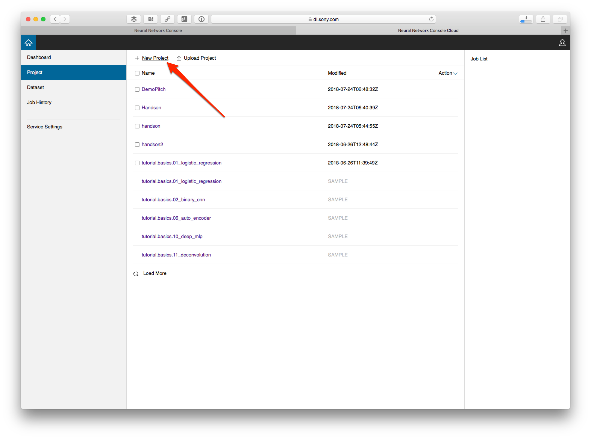

プロジェクト名はアルファベットや英数字が使えます。適当なプロジェクト名を（例えばHandsonなど）入力してOKボタンを押します。

## データを読み込む

プロジェクトを作成すると、下のような画面が表示されます。まずデータを紐付けるために、右上にあるDATASETをクリックします。

データはトレーニング（Training）と検証（Validation）に分かれています。最初はトレーニングが選ばれている状態です。Not Setをクリックします。

そうするとあらかじめ登録してあるデータが一覧表示されます。その中の mnist.small_mnist_4or9_training にマウスを当て、右側にあるリンクアイコンをクリックします。

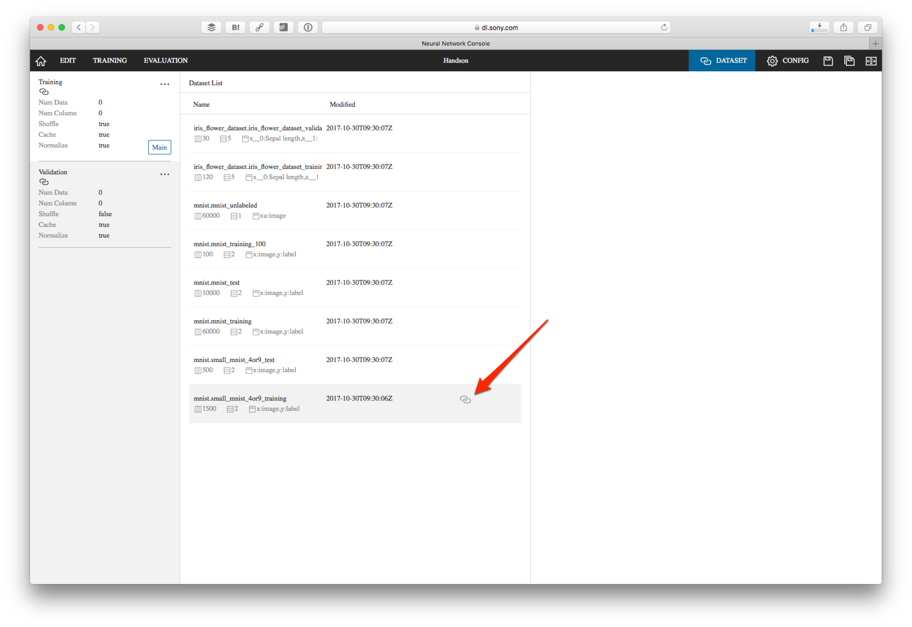

トレーニングのデータをリンクさせると、Trainingと書かれている欄の下にデータ名が表示されます。

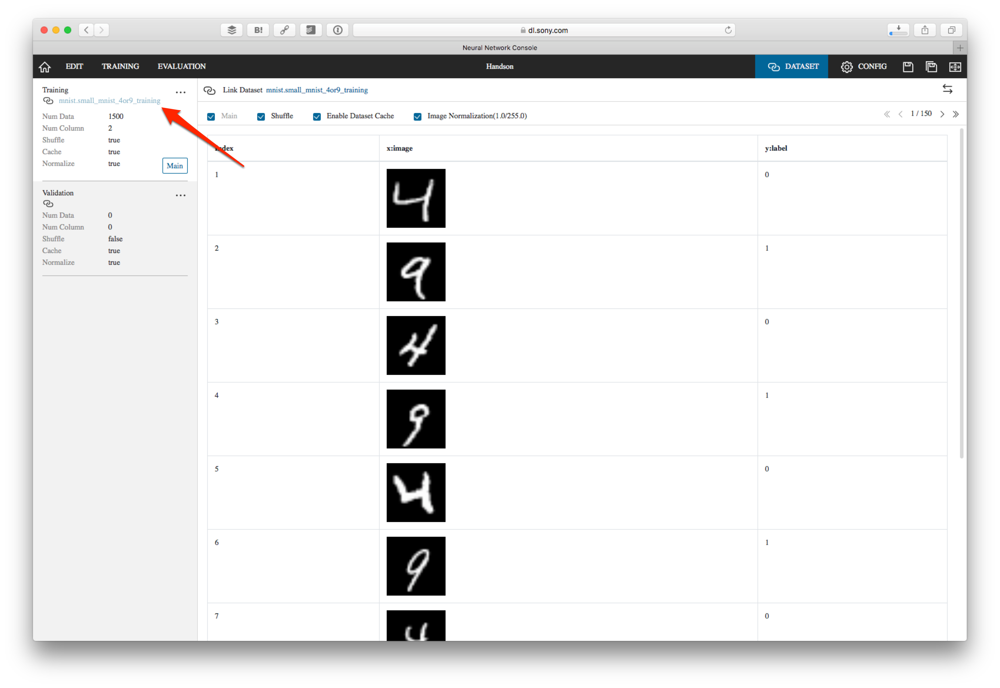

同様に検証（Validation）データとして mnist.small_mnist_4or9_test を紐付けてください。

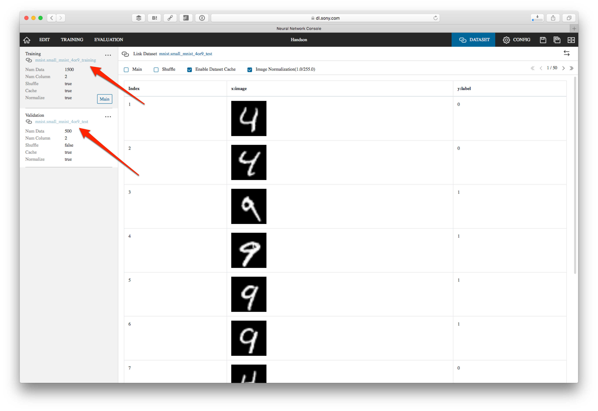

データの紐付けが終わったら、左上にあるEDITをクリックします。

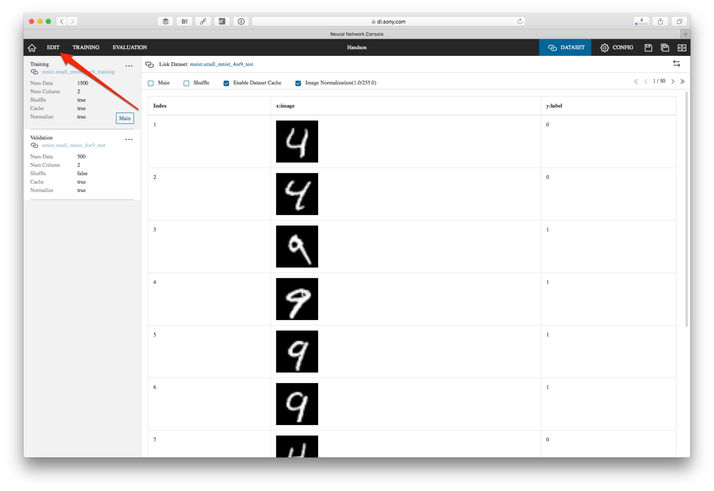

## アルゴリズムの設計

ではいよいよ機械学習のアルゴリズムを作っていきます。まず IO カテゴリにある Input をダブルクリックします（またはドラッグ&ドロップ）。これで入力データが追加されました。

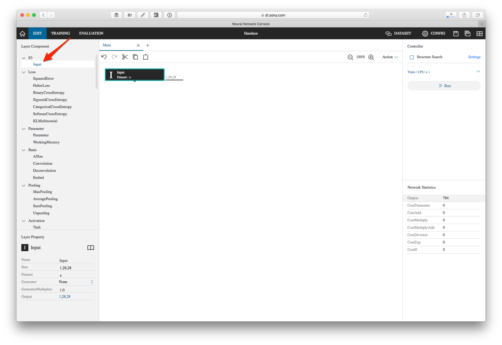

続いてBasicにあるAffineを追加します。Affineで画像データの表示位置を調整します。このAffineを選択して、OutShapeを1にします。

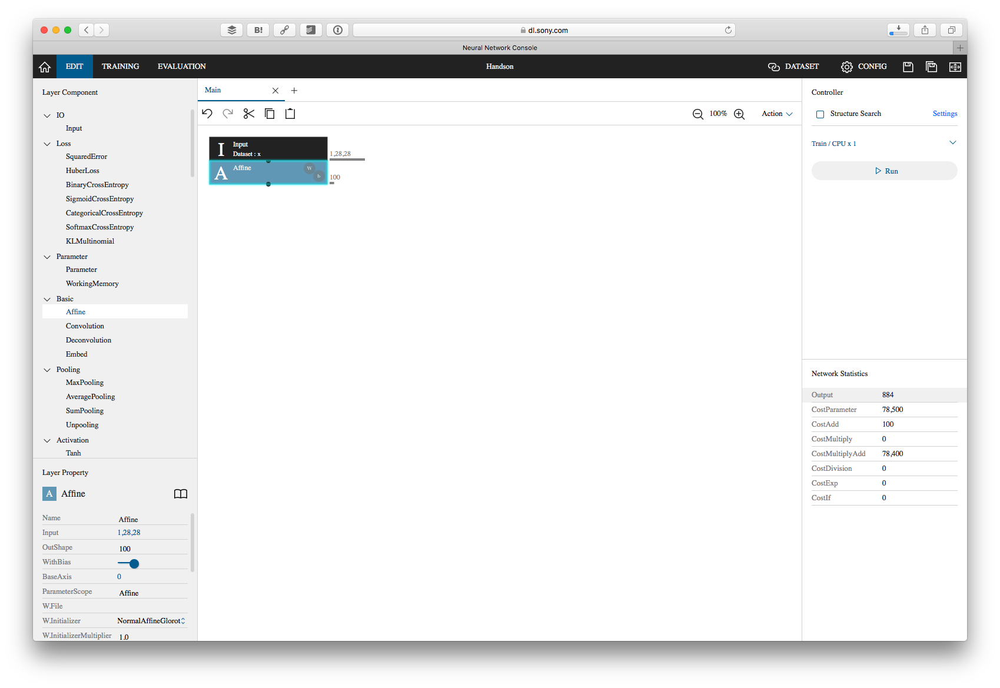

さらにActivation（活性化）としてSigmoidを追加します。これはシグモイド関数になります。最後に出力としてLossにあるBinaryCrossEntropyを追加します。

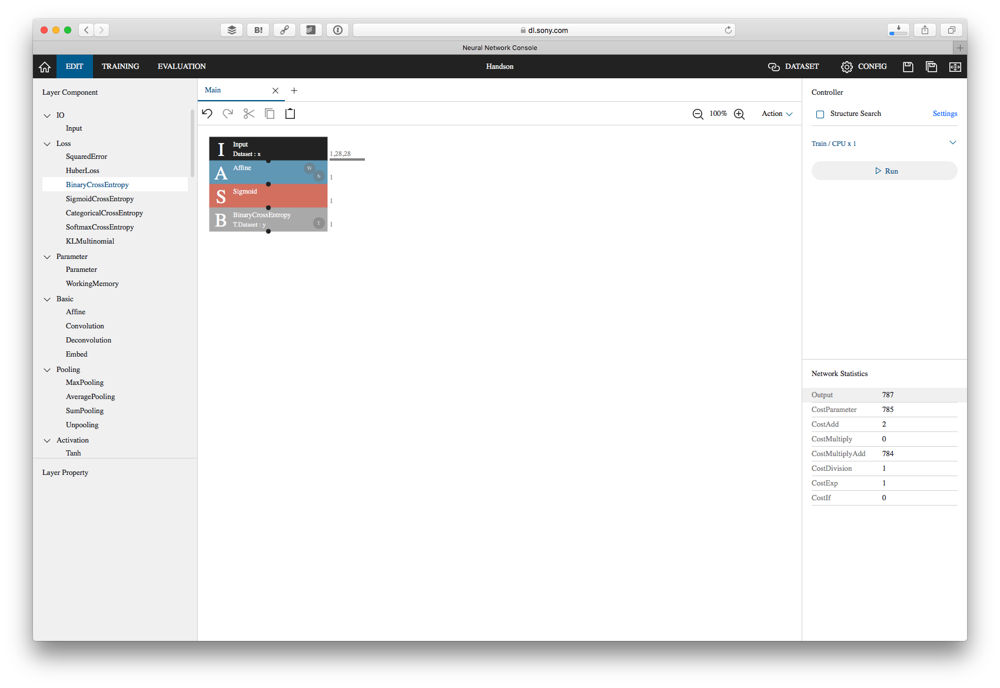

## トレーニングの開始

アルゴリズムの設計が終わったら、右側にある Run ボタンを押します。

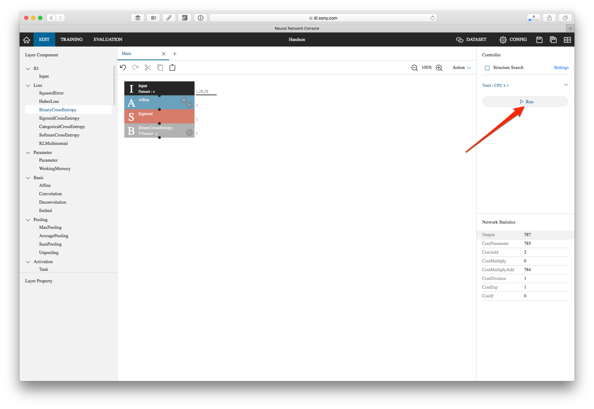

そうすると TRAINING タブに表示が移ってトレーニングが開始されます。CPUであったり、多人数で一気に行うとキューが詰まってしまうかも知れません。その場合には終わるまでお待ちください。トレーニングが終わるとグラフが表示されます。トレーニングが収束しているのを確認してください。

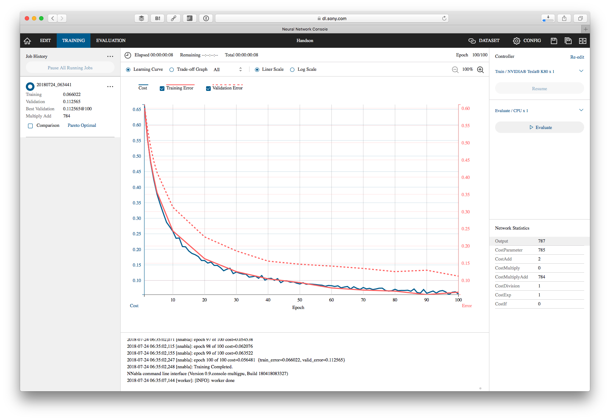

## 評価の開始

続いて右側にある Evalute ボタンを押します。

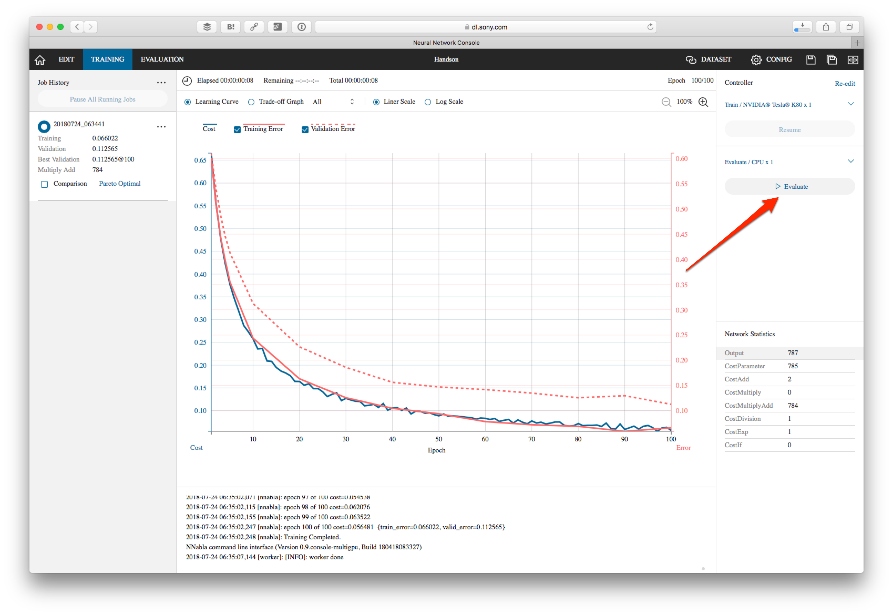

そうすると EVALUTE タブに表示が移って検証が行われます。処理が終わると画像の判定結果が表示されます。

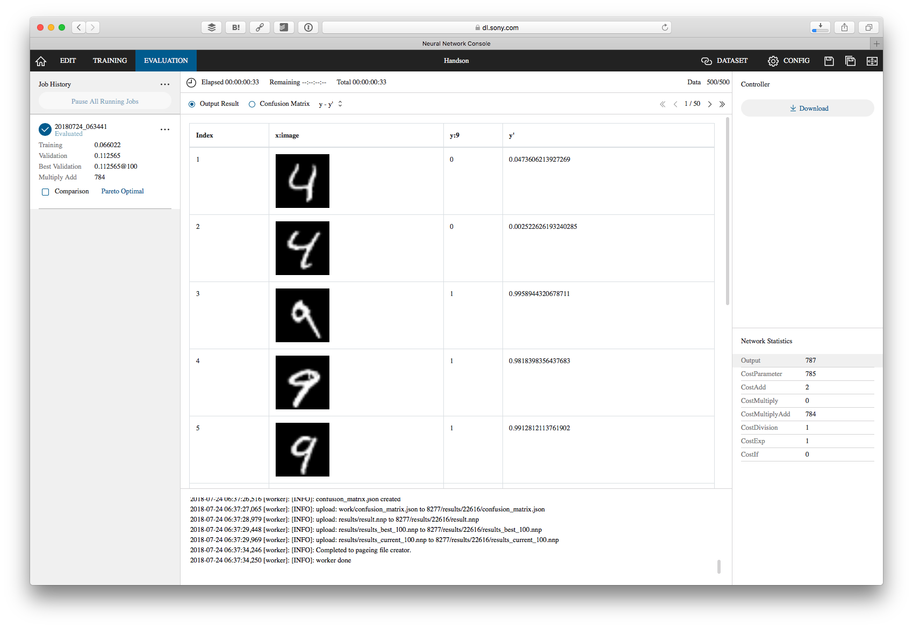

さらに上にあるConfusion Matrixを選ぶと処理全体の評価が確認できます。例えば今回は95%の精度で4と9を分類できたことが分かります。

> さらに詳細に書くと、今回は 9ではない（9=0）つまり4の画像のうち、正しく4と判断できたものが94.8%、9の画像（9=1）のうち、9と正しく判断できたものが95.2%であったと表示されています。

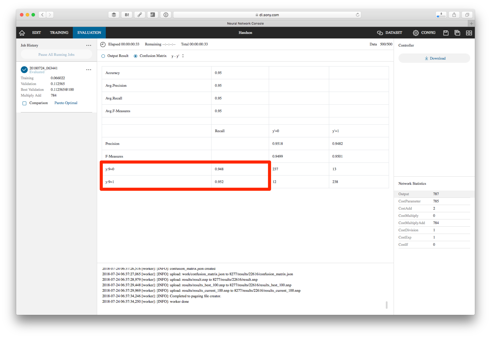

## アルゴリズムの更新

現状のアルゴリズムに手を加えて再度トレーニング、評価してどう結果が変わるのが確認してみましょう。例えば以下のようなアルゴリズムを組んだとします。

この結果は約98%の精度で4と9を分類できています。

複数のトレーニングを行うことで、それぞれのグラフを比較できるようになります。TRAINING タブで、比較したいトレーニングデータの Comparison をチェックしてください。
