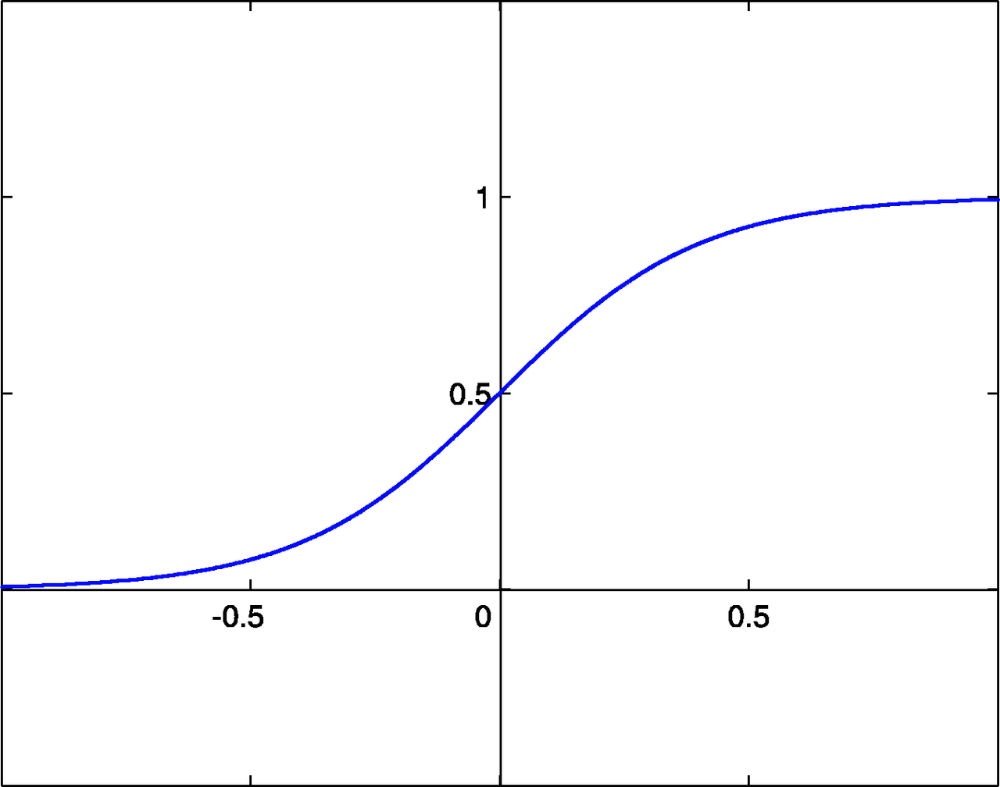
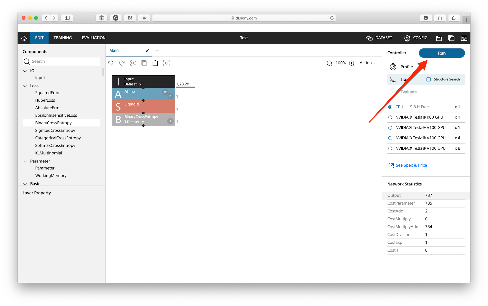
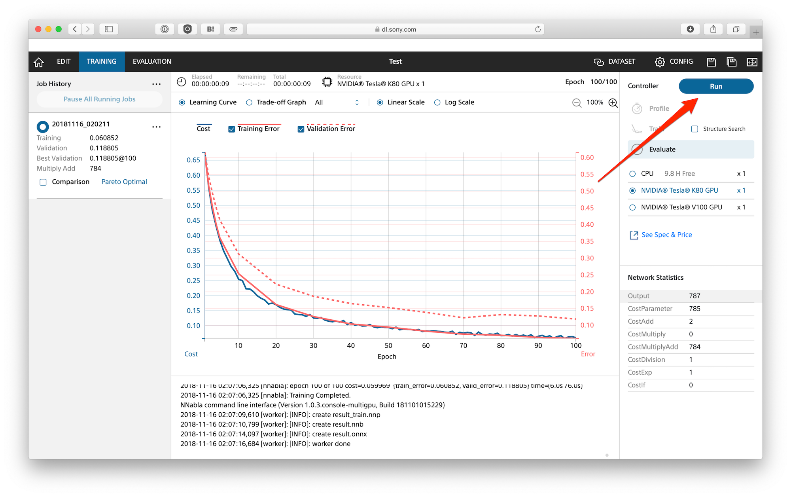
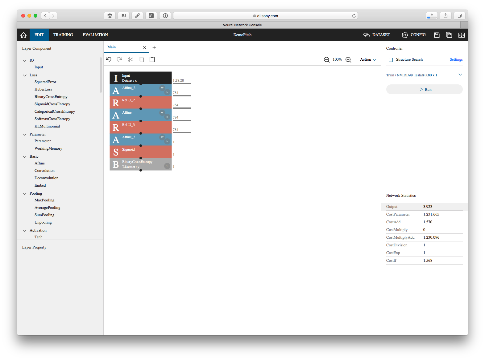
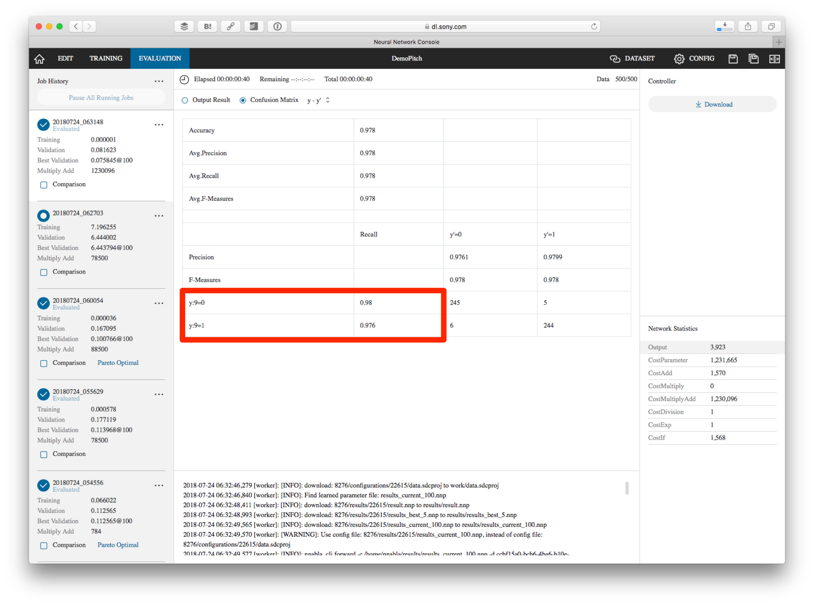
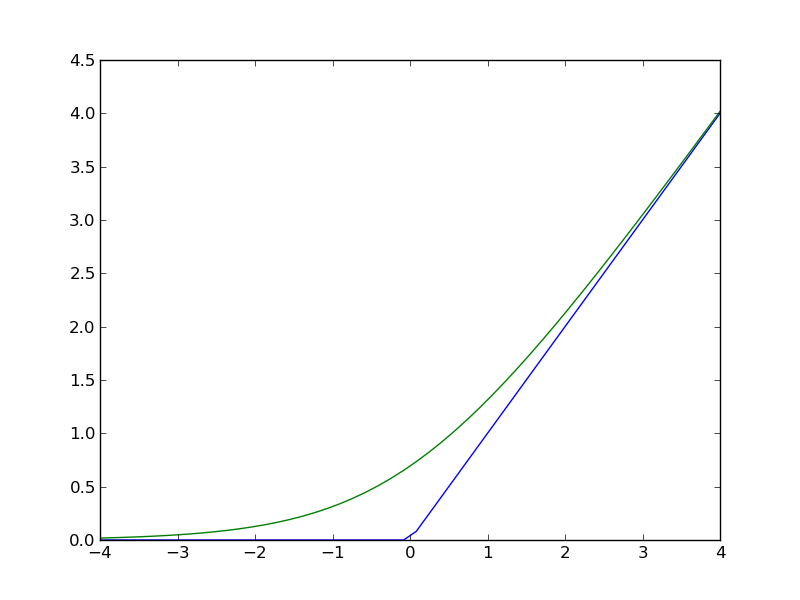

資料のURL　http://bit.ly/nnc-ho-1

## 4と9を区別するディープラーニングを体験する

まず最初に28x28に書かれたモノクロの手書き画像を判別するディープラーニングを体験します。

### プロジェクトを作成する

Neural Network Consoleにログインしたら、左側にあるプロジェクト（Project）を選択します。

New Projectを選択します。

プロジェクト名はアルファベットや英数字が使えます。適当なプロジェクト名を（例えばHandsonなど）入力してOKボタンを押します。

### データを読み込む

プロジェクトを作成すると、下のような画面が表示されます。まずデータを紐付けるために、右上にあるDATASETをクリックします。

データはトレーニング（Training）と検証（Validation）に分かれています。最初はトレーニングが選ばれている状態です。Not Setをクリックします。

そうするとあらかじめ登録してあるデータが一覧表示されます。その中の mnist.small_mnist_4or9_training にマウスを当て、右側にあるリンクアイコンをクリックします。

トレーニングのデータをリンクさせると、Trainingと書かれている欄の下にデータ名が表示されます。

同様に検証（Validation）データとして mnist.small_mnist_4or9_test を紐付けてください。

データの紐付けが終わったら、左上にあるEDITをクリックします。

### アルゴリズムの設計

ではいよいよ機械学習のアルゴリズムを作っていきます。まず IO カテゴリにある Input をダブルクリックします（またはドラッグ&ドロップ）。これで入力データが追加されました。

続いてBasicにあるAffineを追加します。Affineで画像データの表示位置を調整します。このAffineを選択して、OutShapeを1にします。

> Affineはアフィン変換を行うノードです。アフィン変換は画像や数字の均質化を行います。バラバラな場所にある画像を回転、拡大縮尺を行うことで同じような位置に配置します。

さらにActivation（活性化）としてSigmoidを追加します。これはシグモイド関数になります。シグモイド関数は以下のようなグラフを描きます。入力値（横軸）が-1〜+1で変化する際に、その結果を0〜1の範囲で出力します。-0.5以下または+0.5以上の数字はそれぞれ0または1に丸められるのが分かります。

最後に出力としてLossにあるBinaryCrossEntropyを追加します。BinaryCrossEntropyは（バイナリと付いている通り）0または1という結果を出すのに用います。

### トレーニングの開始

アルゴリズムの設計が終わったら、右側にある Run ボタンを押します。

そうすると TRAINING タブに表示が移ってトレーニングが開始されます。CPUであったり、多人数で一気に行うとキューが詰まってしまうかも知れません。その場合には終わるまでお待ちください。トレーニングが終わるとグラフが表示されます。トレーニングが収束しているのを確認してください。

グラフの見方は以下の通りです。

- **Cost**  
最適化段階でのロス関数の出力値
- **Error**  
Epochの終了時点での学習データ、評価データそれぞれにおけるロス関数の出力値

になります。右に進む（世代数が増える）に連れてCostとError両方の値が下がっていれば正しく最適化が行われています。

### 評価の開始

続いて右側にある Run ボタンを押します。

そうすると EVALUTE タブに表示が移って検証が行われます。処理が終わると画像の判定結果が表示されます。

さらに上にあるConfusion Matrixを選ぶと処理全体の評価が確認できます。例えば今回は95%の精度で4と9を分類できたことが分かります。

> さらに詳細に書くと、今回は 9ではない（9=0）つまり4の画像のうち、正しく4と判断できたものが94.8%、9の画像（9=1）のうち、9と正しく判断できたものが95.2%であったと表示されています。

現状のアルゴリズムに手を加えて再度トレーニング、評価してどう結果が変わるのが確認してみましょう。例えば以下のようなアルゴリズムを組んだとします。

この結果は約98%の精度で4と9を分類できています。ReLUはランプ関数と呼びます。

ReLUは以下のようなグラフを描きます（青線）。0以下の場合は0、0以上は入力値をそのまま返す関数です。

複数のトレーニングを行うことで、それぞれのグラフを比較できるようになります。TRAINING タブで、比較したいトレーニングデータの Comparison をチェックしてください。