# あやめの種類を見分けるディープラーニングを体験する

次にあやめ（iris）の種類を見分けるディープラーニングを体験します。あやめは花びらの幅と長さ、がくの幅と長さの4つの要素によってIris setosa、Iris Versicolour、 Iris Virginicaの3つの種類に分類できます。

ぱっと見ただけでは殆ど区別がつきません。しかし上記のパラメータを用いることで、機械によって判別できるようになります。

## プロジェクトを作成する

Neural Network Consoleにログインしたら、左側にあるプロジェクト（Project）を選択します。

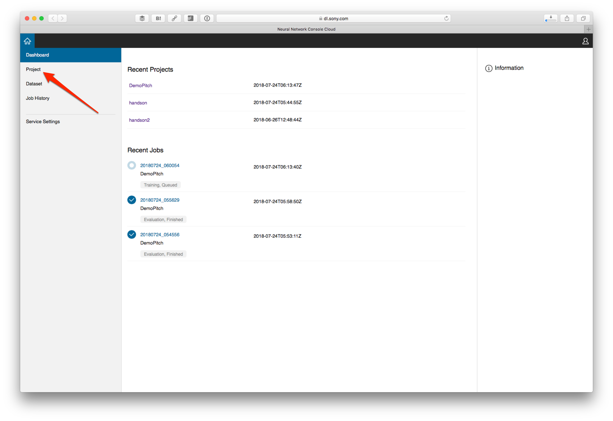

New Projectを選択します。

プロジェクト名はアルファベットや英数字が使えます。適当なプロジェクト名を（例えばHandsonなど）入力してOKボタンを押します。

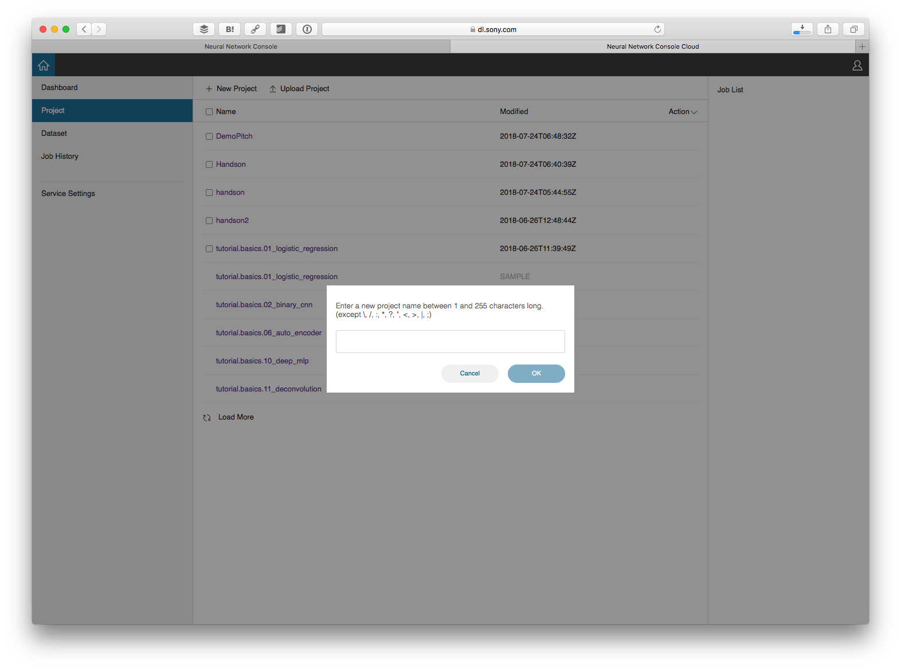

## データを読み込む

プロジェクトを作成すると、下のような画面が表示されます。まずデータを紐付けるために、右上にあるDATASETをクリックします。

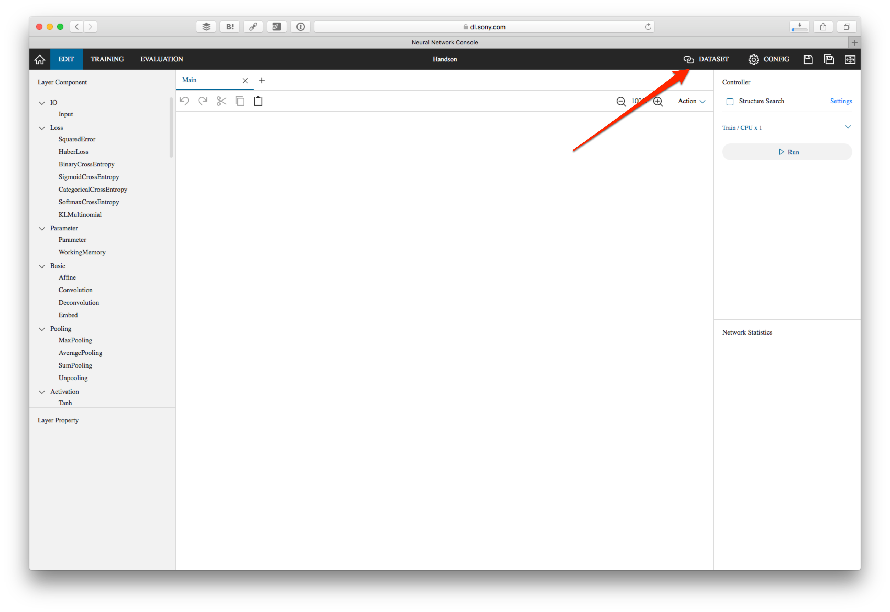

データはトレーニング（Training）と検証（Validation）に分かれています。最初はトレーニングが選ばれている状態です。Not Setをクリックします。

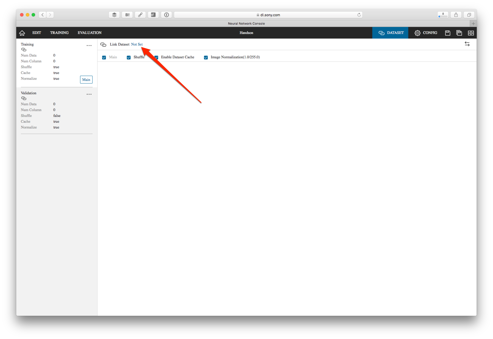

そうするとあらかじめ登録してあるデータが一覧表示されます。その中の iris_flower_dataset.iris_flower_dataset_training_delo にマウスを当て、右側にあるリンクアイコンをクリックします。

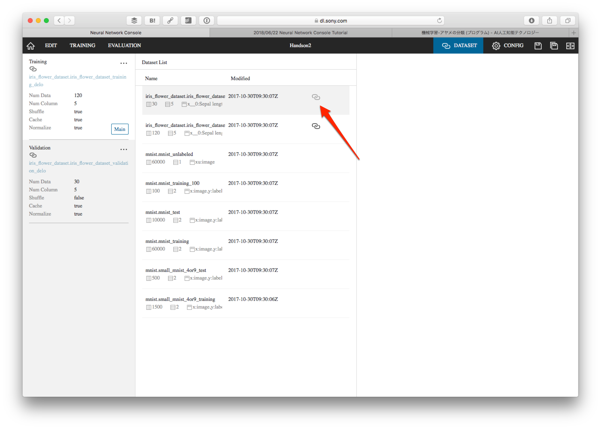

トレーニングのデータをリンクさせると、Trainingと書かれている欄の下にデータ名が表示されます。

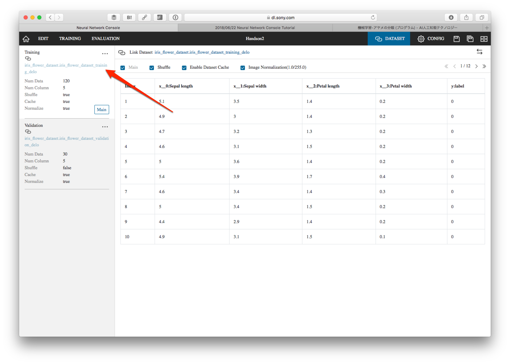

同様に検証（Validation）データとして iris_flower_dataset.iris_flower_dataset_validation_delo を紐付けてください。

データの紐付けが終わったら、左上にあるEDITをクリックします。

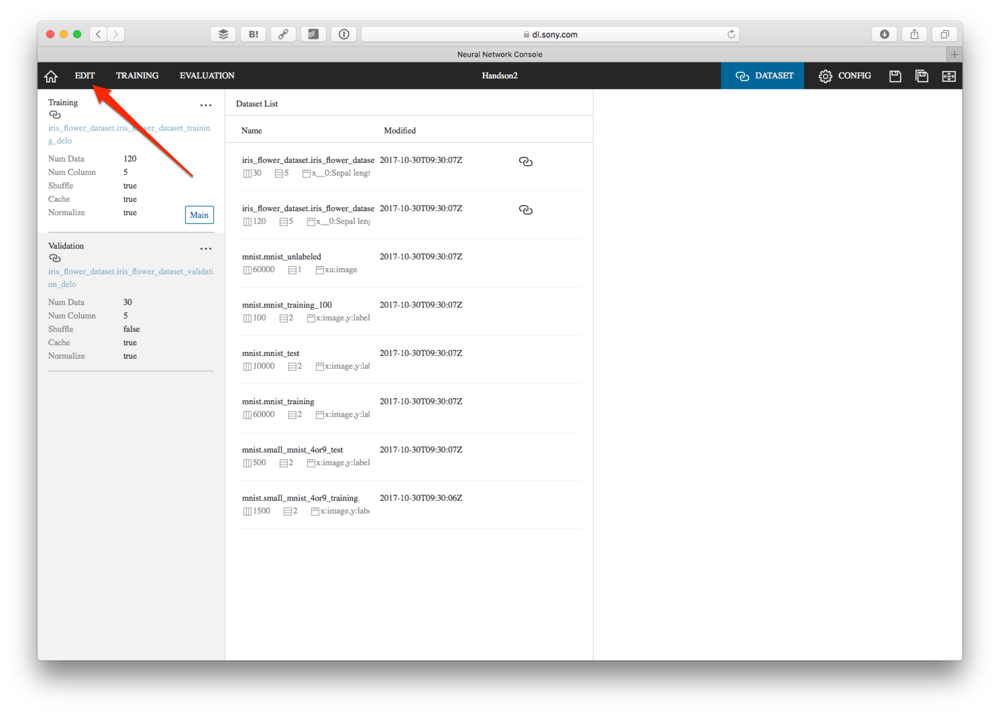

## アルゴリズムの設計

ではいよいよ機械学習のアルゴリズムを作っていきます。まず IO カテゴリにある Input をダブルクリックします（またはドラッグ&ドロップ）。これで入力データが追加されました。サイズ（Size）を4とします（パラメータが4要素のため）。

続いてBasicにあるAffineを追加します。このAffineを選択して、OutShapeを3にします（分類が3パターンのため）。

さらにActivation（活性化）としてSoftmaxを追加します。これはソフトマックス関数になります。ソフトマックス関数によって、結果を確立に変換します。最後に出力としてLossにあるCategoricalCrossEntropyを追加します。

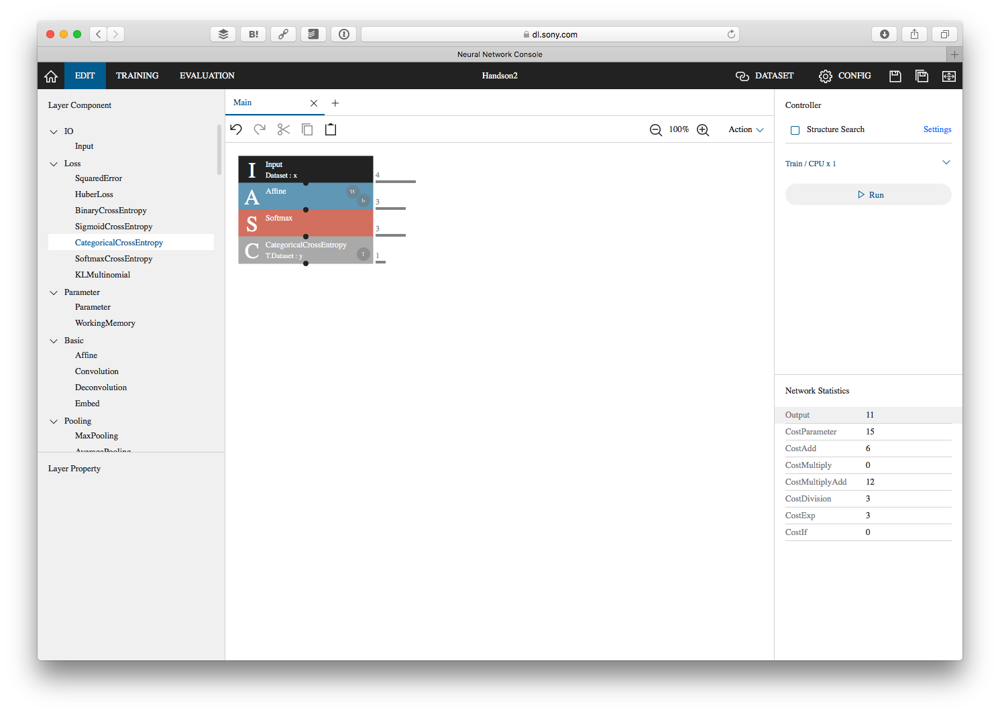

## CONFIGの変更

右上にあるCONFIGをクリックしてCONFIGを表示します。Batch Sizeを10とします。

## トレーニングの開始

アルゴリズムの設計やCONFIGの変更が終わったら、EDITタブに戻って右側にある Run ボタンを押します。

そうすると TRAINING タブに表示が移ってトレーニングが開始されます。CPUであったり、多人数で一気に行うとキューが詰まってしまうかも知れません。その場合には終わるまでお待ちください。トレーニングが終わるとグラフが表示されます。トレーニングが収束しているのを確認してください。

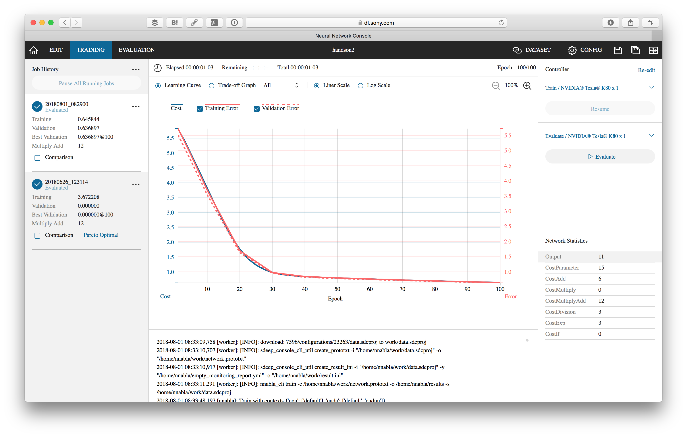

## 評価の開始

続いて右側にある Run ボタンを押します。

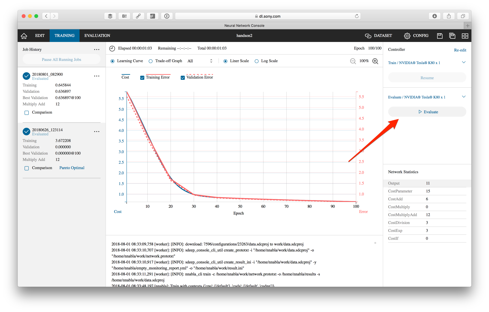

そうすると EVALUTE タブに表示が移って検証が行われます。処理が終わると評価結果が表示されます。評価結果を見ると、次のようなことが分かります。

- **Iris Setosa（y=0）** → 100％（10/10正しく評価）
- **Iris Versicolour（y=1）** → 50%（10あるデータの内、5つしか正しく判定できていない）
- **Iris Virginica（y=2）** → 66%（10あるデータは10正しく判定、ただし y=1のデータが5つ誤判定）

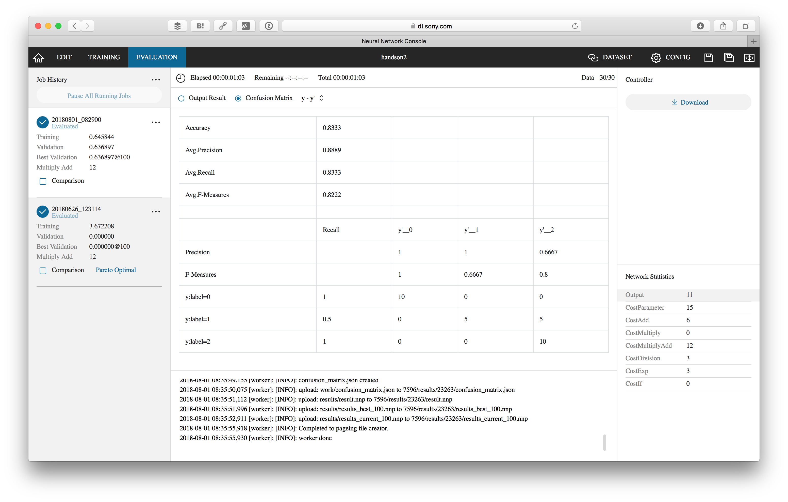

## アルゴリズムの更新

現状のアルゴリズムに手を加えて再度トレーニング、評価してどう結果が変わるのが確認してみましょう。例えば以下のようなアルゴリズムを組んだとします。

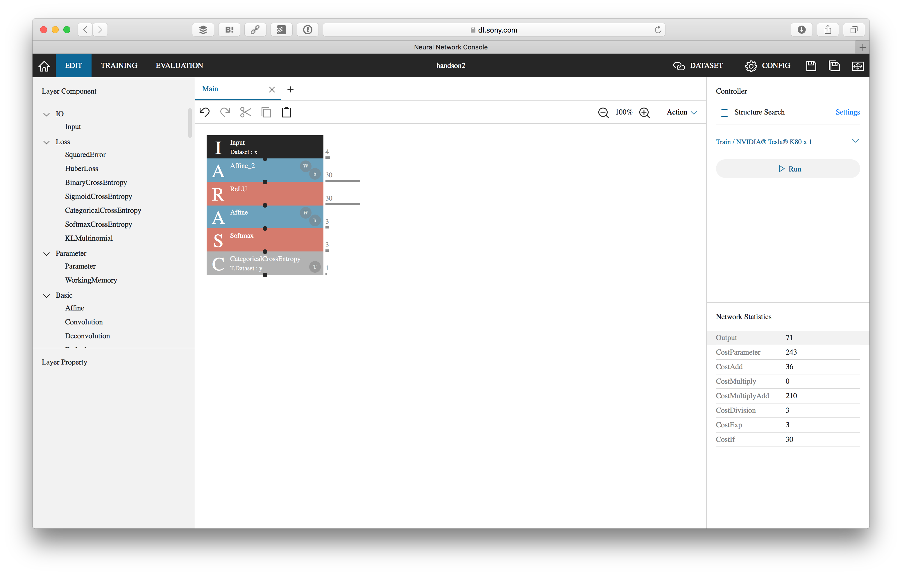

この結果は100%正確に分類分けできます。

複数のトレーニングを行うことで、それぞれのグラフを比較できるようになります。TRAINING タブで、比較したいトレーニングデータの Comparison をチェックしてください。
