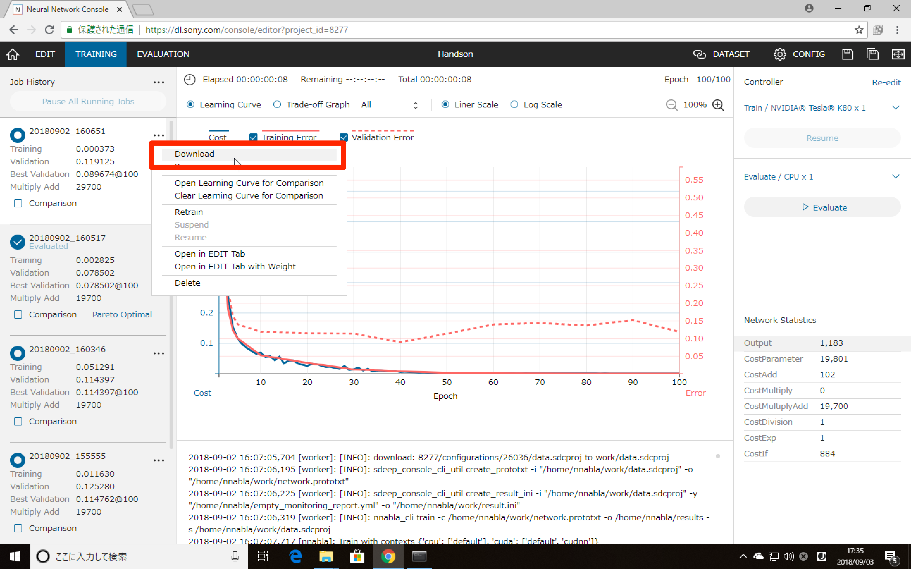
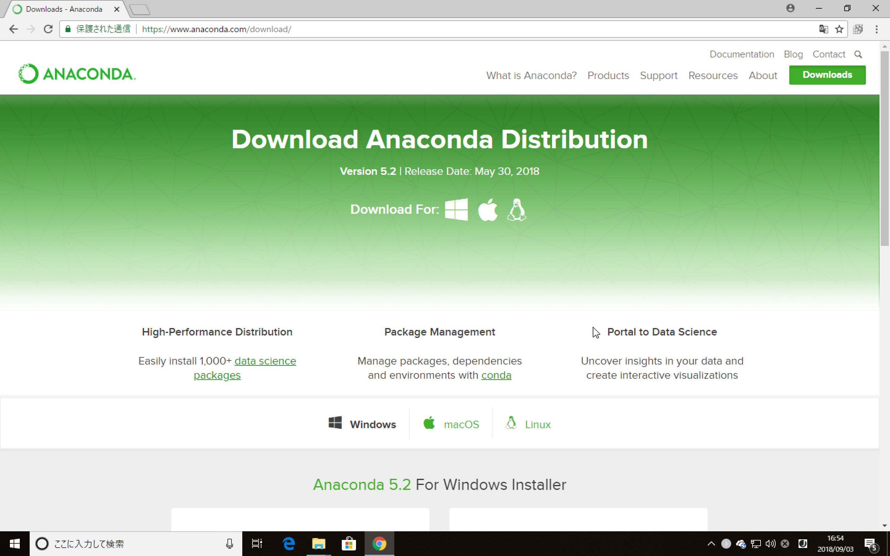
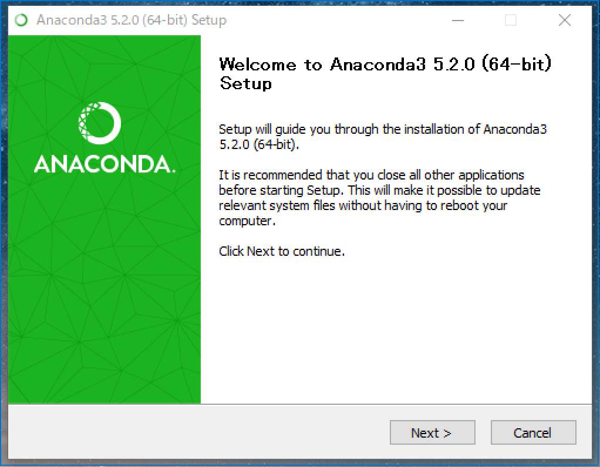
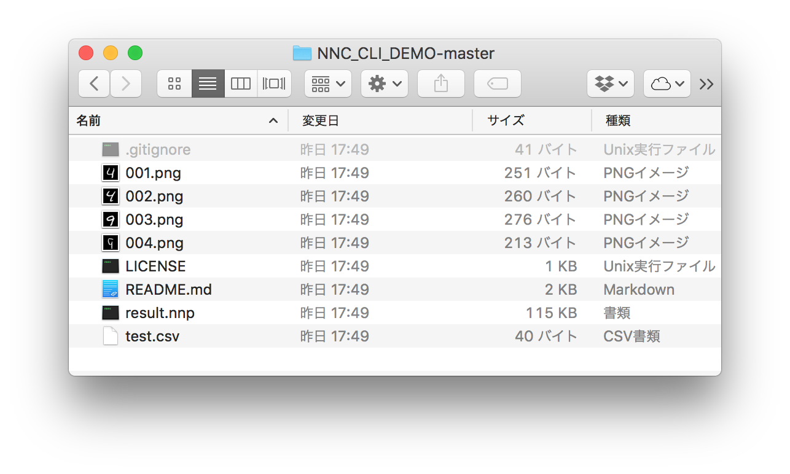

# 作成したモデル、ネットワークをローカルコンピュータで体験する

では作成した4か9かを見分けるディープラーニングをローカルコンピュータで使ってみましょう。CLI（コマンドライン プログラミング インタフェース）であれば今回はプログラミングを書かずに試す方法を紹介します。なお、今回はクラウド版を対象に紹介します。

## ネットワークと学習済みのパラメータをダウンロードする

まず作成したネットワークと学習済みのパラメータをダウンロードします。これはトレーニング（TRAINING）または検証（EVALUTION）タブに移動して、ジョブ履歴の中からダウンロードしたい学習結果の三点リーダー（…）をクリックします。そして出てきたメニューのDownload（ダウンロード）をクリックします。

**最初の課題である4/9を判別するディープラーニングのネットワークをダウンロードしてください。アヤメではありません。**



そうすると result.nnp というファイルがダウンロードされます。これがディープラーニングのネットワークと学習済みのパラメータが入った内容になります。

## Python環境を整える

このファイルを扱うためにPython 3.6をインストールします。ディープラーニングを行っていくのであれば素のPythonよりも[Anaconda](https://www.anaconda.com/)をインストールする方が良いでしょう。Anacondaはディープラーニングを行うのに便利な、必須とも言えるライブラリがあらかじめインストールされています。macOSやLinuxについてもデフォルトでは3.7系のPythonになってしまい、nnablaがインストールできなかったり、算術系のライブラリが不足しているのでAnacondaの利用をお勧めします。



AnacondaはWindows/macOS/Linux向けにそれぞれリリースされています。自分の環境に合わせたものをダウンロード、インストールしてください。

[Downloads - Anaconda](https://www.anaconda.com/download/#macos)

## Anacondaを実行する

Windowsの場合は、Anacondaをスタートメニューから実行します。そうするとパスにPythonなどが入った状態のコマンドプロンプトが立ち上がります。macOSやLinuxの場合はターミナルを立ち上げて、以下のコマンドを入力するとAnacondaのPythonが優先実行されます。

```
export PATH="~/anaconda3/bin:$PATH"
```



まずPythonのライブラリ管理であるpipをアップデートします。

```
python -m pip install --upgrade pip 
```

次にディープラーニング用ライブラリのnnablaをインストールします。

```
pip install nnabla
```

nnablaをインストールすると、以下のコマンドが使えるようになります。

```
nnabla_cli
```

これがNNCを試す際のコマンドになります。これで準備完了です。

## デモをダウンロードする

デモ用のリポジトリを用意しています。こちらをダウンロードして、Zipを展開してください。

http://bit.ly/nnc_cli_demo



中には以下のようなファイルがあります。

- 001〜004.png  
テスト用の画像
- result.nnp  
あらかじめダウンロードしておいたNNCのモデル/ネットワーク
- test.csv  
テスト用のCSVファイル
- web/  
[ハンズオン4回目](./4.md)の内容です

result.nnp はあなたがダウンロードしたものと差し替えてください。

### test.csvについて

test.csvは以下のような内容になっています。今回は検証目的に使うので、yカラムはありません。

```
x:image
001.png
002.png
003.png
004.png
```

指定されている画像は、同じフォルダ内にある画像ファイルを指定しています。

## 実行する

では実際に試してみましょう。上記のファイルをダウンロード、解凍したディレクトリでコマンドを以下のように実行します。

```
nnabla_cli forward -c result.nnp -d test.csv -o ./
```

`-c` で学習した内容を、 `-d` で評価するCSVファイルを指定します。最後の `-o` は実行結果の出力先です。

実行すると `output_result.csv` と `progress.txt` が出力されます。大事なのは `output_result.csv` です。内容を見ると、以下のようになっています（実行環境によって異なるかも知れません）。

```
x:image,y'
/path/to/001.png,0.00019709873595274985
/path/to/002.png,1.0769620750750164e-08
/path/to/003.png,0.9999932050704956
/path/to/004.png,0.9113416075706482
```

今回は 001〜002.pngまでが4を書いたもの、003〜004.pngが9を書いたものになります。ただしく判定されているのが分かります。

## 別な画像ファイルで試す

画像は[myleott/mnist_png](https://github.com/myleott/mnist_png)にあるものをお借りしています。他にもたくさんの4、9画像がありますので、ダウンロードして試してみてください。ファイルを追加したらtest.csvを更新するのを忘れないでください。

http://bit.ly/mnist_png

----

このように自分で作ったモデル、ネットワークをコンピュータ上で実行できます。コマンドを実行して、結果のCSVファイルを読むという方法であればPython以外のプログラムからでもNNCが利用できます。