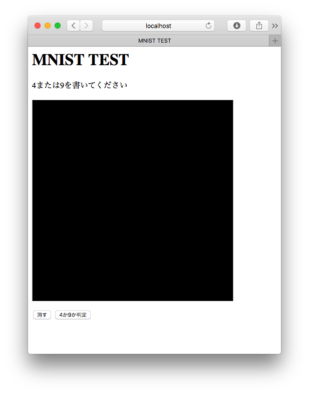
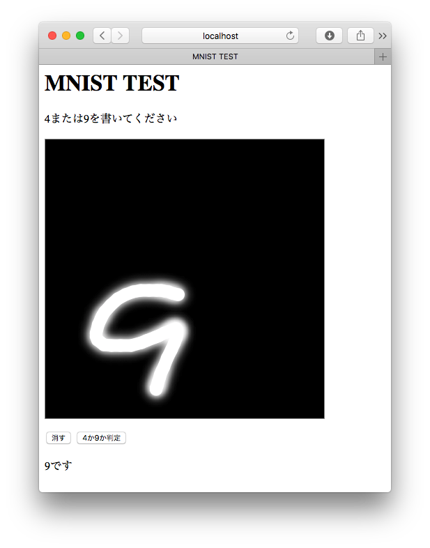

# 作成したモデル、ネットワークをWebアプリケーションで体験する

3回目のCLIで作った環境をそのまま使っていきます。もしAnacondaやnnablaをインストールしていなかったら、[ハンズオン3回目](./3.md)の内容を実施してください。

今回はPythonを使って、Webアプリケーションの中にどう組み込めば良いかを解説します。

## Webフレームワークをインストールする

今回はPython製の簡易的なWebフレームワーク bottle を使います。これはコマンドプロンプトやターミナルで実行します。

```
pip install bottle
```

## HTMLの解説

まずWebアプリケーションの画面を紹介します。今回はCanvasタグを使ってマウスで文字を書き、それをサーバに送る仕組みとします。JavaScriptのコードはコメントを参照してください。コードは[endoyuta/mnist_test](https://github.com/endoyuta/mnist_test)のHTMLを参考にさせてもらっています。ファイルは前回ダウンロードしたGitリポジトリのwebフォルダの中にあります。

## app.pyの編集

編集前は `web/app.py` は以下のようになっています。

```py
def image():
    img_str = request.params['img']
    if img_str == False:
        return "{}"
    
    # 画像を28x28、グレースケールに変換
    b64_str = img_str.split(',')[1]
    img = Image.open(BytesIO(a2b_base64(b64_str)))
    img = img.resize((28, 28))
    img = img.convert('L')
    
    # Neural Network Consoleのファイルを読み込む
    
    # 実行するネットワークを指定する
    
    # 入力変数を取得
    
    # 出力変数を取得
    
    # 画像を配列に変換、数値を0〜1.0にする
    
    # 判定する
    
    # 結果を出力する
```

コード中のコメントアウトされている部分を編集していきます。

### Neural Network Consoleのファイルを読み込む

ダウンロードした result.nnp を読み込みます。 `web` フォルダの一つ上の階層にあるはずなので、以下のように記述します。大文字、小文字も区別されるので注意してください。

```py
# Neural Network Consoleのファイルを読み込む
nnp = nnp_graph.NnpLoader('../result.nnp')
```

### 実行するネットワークを指定する

ネットワーク/モデルを読み込んだら、実行するネットワークを取得します。 `MainRuntime` という名前は Neural Network ConsoleのCONFIGタブで確認できます。

```py
# 実行するネットワークを指定する
graph = nnp.get_network('MainRuntime', batch_size=1)
```

### 入力変数を取得

入力変数（今回はx）を取得します。入力が複数ある場合は、複数指定しなければいけません。今回は一つなので、入力値の最初の値（一つしかないので）を指定します。

```py
# 入力変数の名前を取得
input = list(graph.inputs.keys())[0]
x = graph.inputs[input]
```

### 出力変数の名前を取得

出力も同じように取得します。今回は一つしかないので入力と同じように取得できます。

```python
# 出力変数の名前を取得
output = list(graph.outputs.keys())[0]
y = graph.outputs[output]
```

### 画像を配列に変換、数値を0〜1.0にする

HTMLから受け取った画像を配列に変換する際には numpy というライブラリが使えます。ディープラーニングを行う際にはよく使うライブラリです。そして、NNCでは-1.0〜1.0の値のみ扱えますので、配列を255で割ります。

```py
# 画像を配列に変換、数値を0〜1.0にする
x.d = np.array(img) * (1.0 / 255.0)
```

### 判定する

入力変数の準備ができたら、後は判定するだけです。判定は以下のようにします。

```py
# 判定する
y.forward(clear_buffer=True)
```

### 結果を出力する

結果をHTMLに返します。この時、HTMLでも判別しやすいようにJSON形式で返します。結果は `y.d` の中に入っており、今回の場合は `y.d[0][0]` で取得できます。

```py
# 結果を出力する
response.content_type = 'application/json'
return '{{"result": {}}}'.format(y.d[0][0])
```

## 実行する

ではPythonを実行します。

```
cd web
python app.py
```

その後、Webブラウザで http://localhost:8080/ にアクセスします。HTML画面が表示されれば成功です。



手書きで4または9を書いて、サーバに送信します。ディープラーニングによって判定され、その結果が返ってきます。



----

今回のコードで、ディープラーニングのネットワークを作るコードは一切書いていないのが分かります。ダウンロードした result.nnp ファイルからディープラーニングのネットワーク情報や重みを取得することで、プログラミングはとてもシンプルになります。
