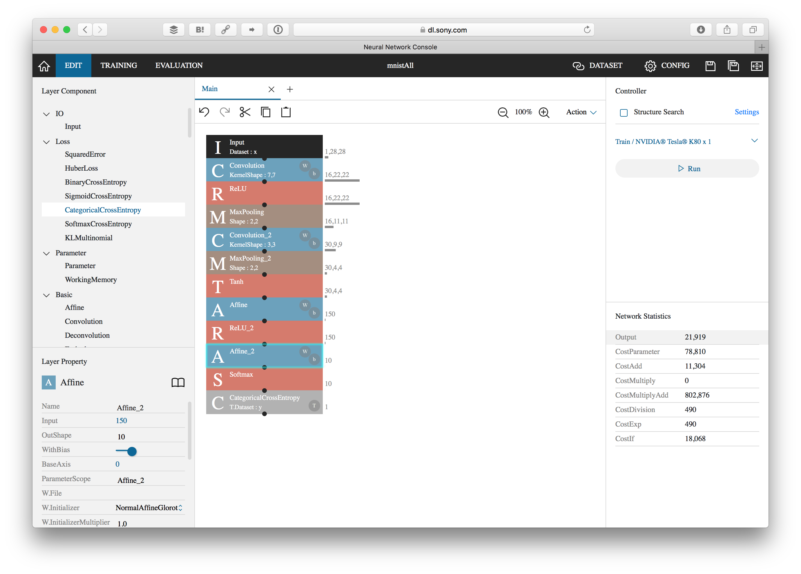
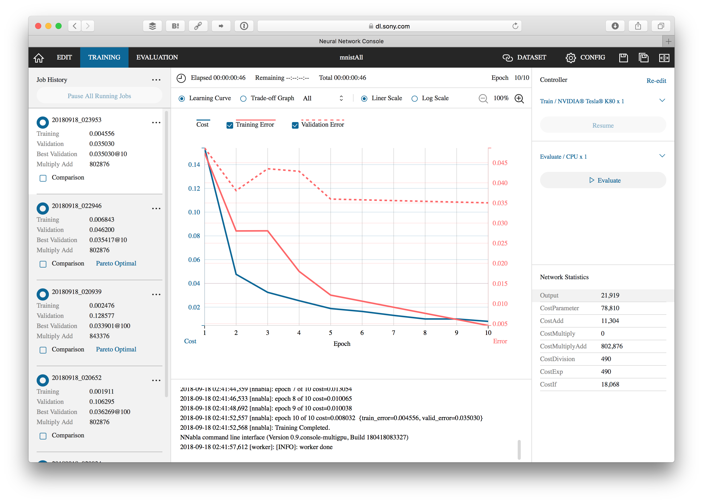
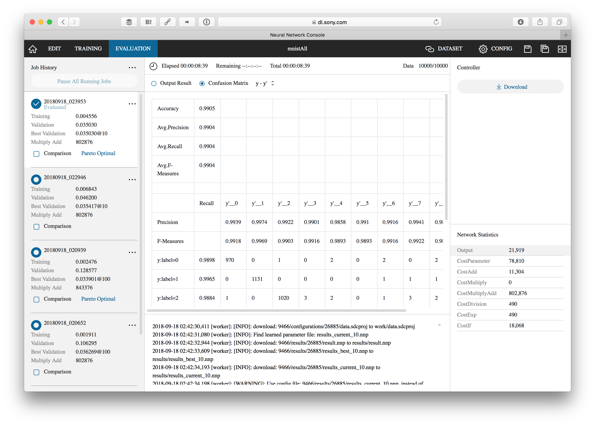
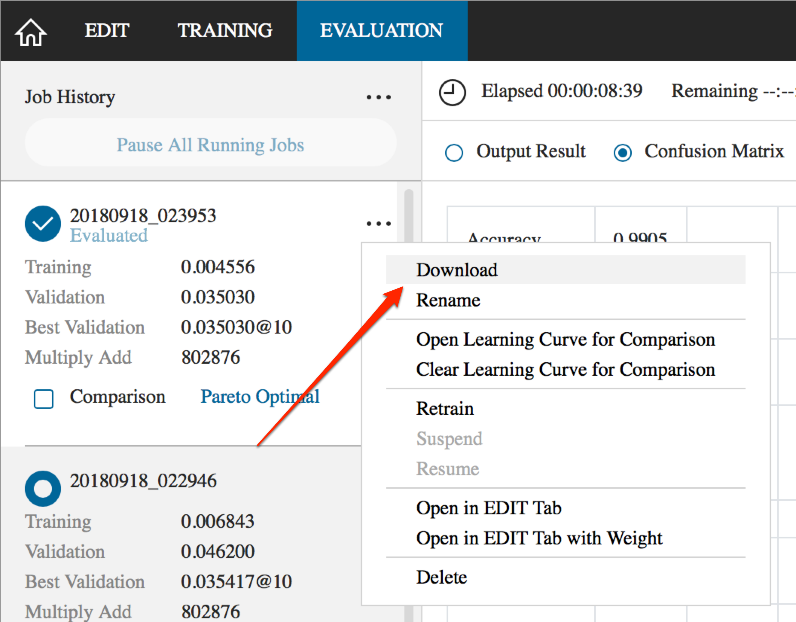
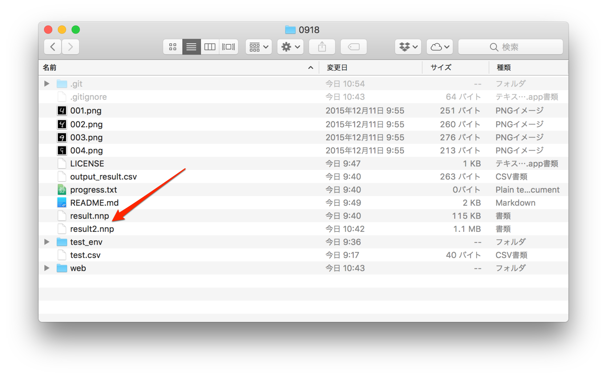
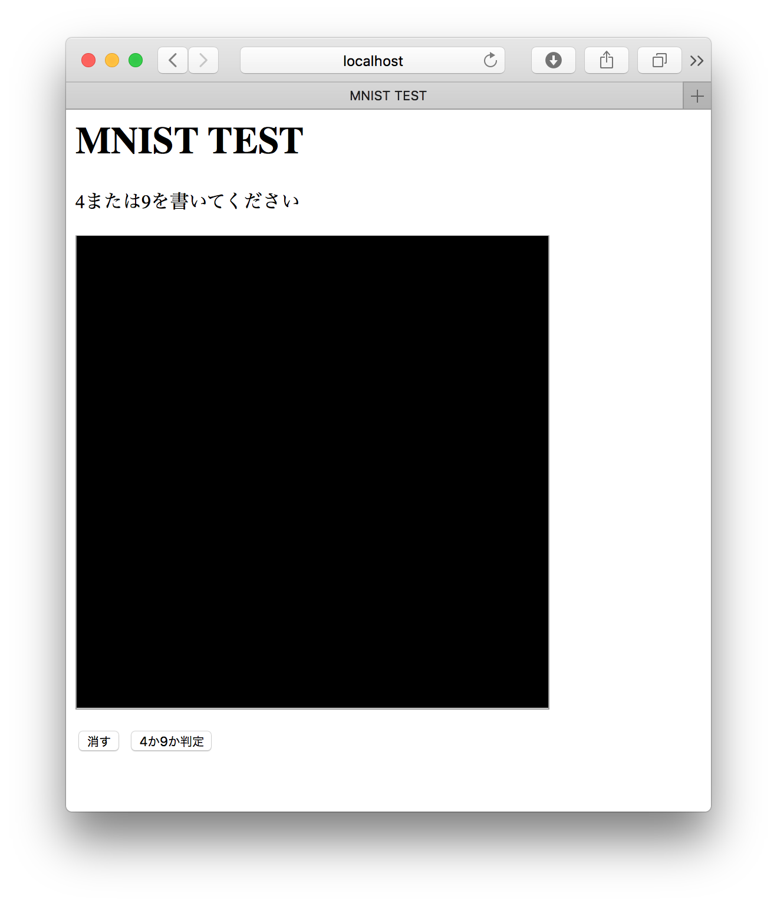
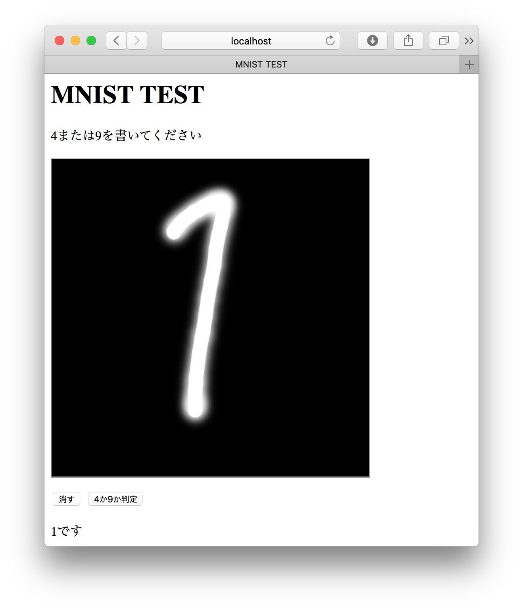

# より複雑なネットワークをWebアプリケーションで試す

今回はより複雑なネットワークを体験します。4か9だけでなく、0〜9までの数値を判別できるようにします。

## 作成するネットワーク

### データセット

新しいプロジェクトを作成して、`mnist.mnist_training` をトレーニング、 `mnist.mnist_test` をテストデータとして指定してください。

### ネットワーク

作成するネットワークは以下のようになります。パラメータを変更しているものについては下に設定を記述しています。

- **Input**
- **Convolution**  
KernelShape : 7,7  
WithBias : True
- **ReLU**
- **MaxPooling**  
IgnoreBorder : True
- **Convolution**  
OutMaps : 30  
KernelShape : 3,3
- **MaxPooling**  
IgnoreBorder : True
- **Tanh**
- **Affine**  
OutShape : 150
- **ReLU**
- **Affine**  
OutShape : 10
- **Softmax**
- **CategoricalCrossEntropy**



### 設定

CONFIGで、Max Epochを10にします。

## 学習の実施

トレーニングを実施します。10エポックなのですぐに終わるでしょう。



## 検証の実施

続けて検証を実施します。98%くらいの精度になるでしょう。



## ネットワークのダウンロード

検証が終わったら、そのネットワーク情報をダウンロードします。



ダウンロードしたら result2.nnp としてCLIで実行したresult.nnpと同じフォルダにいれます。あらかじめ result2.nnp は存在しますが、上書きして構いません。



## web/app.pyの修正

今回は 0または1ではなく、0〜9それぞれの数字において可能性が返ってきます。イメージとしては書きのようになります。最初が0の可能性、次が1の可能性…となります。この中で一番1に近いものが対象の数値になります。今回であれば8です。

```
[3.5272753e-03 1.0275582e-07 3.2790832e-03 3.3631185e-03 3.5058970e-06
  1.4182813e-03 2.3267221e-05 1.2304156e-06 9.7950816e-01 8.8759838e-03]
```

> e-01 は 浮動小数点表記になります。9.7e-01は0.97、8.8e-03は0.0088になります。通常は一番eが少ないものが対象になるでしょう。

これらは可能性なので、100で割るとパーセントになるものです。つまり最も1.0近いものが手書きされた文字になります。

### 読み込むネットワークの変更

先ほどダウンロード、配置したnnpファイルに変更します。

```py
# Neural Network Consoleのファイルを読み込む
# 修正前
nnp = nnp_graph.NnpLoader('../result.nnp')

# 修正後
nnp = nnp_graph.NnpLoader('../result-2.nnp')
```

### 関数の追加

0〜9の可能性について、最も1に近いものを算出する関数を追加します。 `run(host='localhost', port=8080)` の上に追加します。

```py
# この関数を追加
def getNearestValue(list, num):
    # リストの差分を絶対値で算出し、差分が一番小さいインデックスを取得
    idx = np.abs(np.asarray(list) - num).argmin()
    return idx

run(host='localhost', port=8080)
```

via [Pythonのリスト要素からある値と最も近い値を取り出す - Qiita](https://qiita.com/icchi_h/items/fc0df3abb02b51f81657)

### データを返す部分を修正

画像を判定した後、先ほど追加した関数を実行して最も1に近い可能性を持った数値を取得します。そして、それをHTMLに返します。

```py
# HTMLに返す
number = getNearestValue(y.d[0], 1.0)      # ← 追加
return '{{"result": {}}}'.format(number)   # ← 修正
```

## web/index.html を修正

前はPythonからの返却値に応じて処理を判別していましたが、それが不要になります。一番下の方にある表示処理を修正します。

```js
// 修正前
document.querySelector("#answer").innerText = (json.result > 0.2 ? '9' : '4') + 'です';

// 修正後
document.querySelector("#answer").innerText = json.result + 'です';
```

これで修正は完了です。修正後のファイル（web/app.py）を以下にアップロードしてありますので、問題があったら確認してください。

[NNCデモ（0〜9の数字判定）](https://gist.github.com/goofmint/566f81d42eab265acaa4283adac53b58)

## 実行する

ではPythonを実行します。

```
cd web
python app.py
```

その後、Webブラウザで http://localhost:8080/ にアクセスします。HTML画面が表示されれば成功です。



手書きで0〜9の数字を書いて判定させてみましょう。正しい判定が行われていれば、ネットワークやモデルが正しく組めているということになります。



----

今回のデモで分かる通り、NNCの処理自体は殆ど変更していません。nnpファイルにはネットワーク構造や重みに関する情報が入っていますので、それらを用いることで再利用性の高いコーディングが実現できます。
